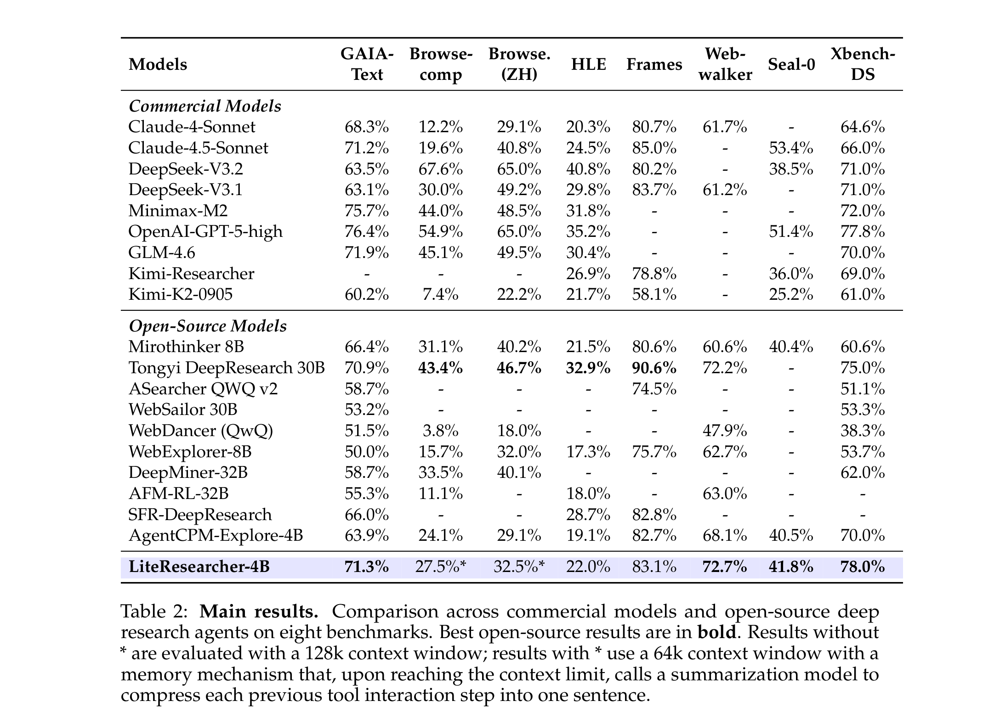

<div align="center">


### A Low-Cost, Scalable Agentic RL Training Framework for Deep Research Agent

[Paper](https://arxiv.org/abs/2604.17931) · [Project Page](https://simplex-ai-inc.github.io/LiteResearcher/) · [Model](https://huggingface.co/simplex-ai-inc/LiteResearcher-4B)

</div>

**LiteResearcher** is a training framework that makes Agentic RL scalable for deep research agents. By constructing a lite virtual world that mirrors real-world search dynamics, we enable a continuously improving training recipe that empowers a tiny 4B search agent to outperform large-scale open-source and commercial models.

**LiteResearcher-4B** is a low-cost, scalable 4B deep research agent: its RL stage runs entirely inside a local search/browse environment, requiring no external APIs during RL and incurring zero marginal API cost.

**LiteResearcher-4B** achieves **71.3%** on GAIA and **78.0%** on Xbench-DeepSearch, surpassing models up to 8× larger (Tongyi DeepSearch 30B, WebSailor 30B) and matching commercial systems (Claude-4.5-Sonnet, GPT-5).

## Results

<div align="center">

</div>

Table 2 from the paper compares LiteResearcher-4B against commercial models and open-source deep research agents across eight benchmarks. Best open-source results are in **bold**. Results with * use a 64k context window with a memory mechanism.

## Method Overview

<div align="center">

</div>

Three pillars enable low-cost, scalable Agentic RL:

1. **Co-construct Training Data & Corpus** — Scale up information sources with a simple-but-effective synthesis pipeline, then co-evolve training QA pairs and the local webpage corpus.
2. **Stable Local Tool Environment** — Build local search engine (Milvus + BGE-M3) and local browse tool (PostgreSQL) from ~32M real webpages, enabling the RL stage to run fully locally with no API consumption, 10–46× speedup, and zero marginal tool cost.
3. **Difficulty-Aware Curriculum RL** — Multi-stage curriculum with on-policy GRPO, filtering tasks by pass@8 difficulty to sustain monotonic improvement.

## Repository Structure

```
├── Inference/              # Inference & evaluation (released)
├── Training/               # RL training (coming soon)
├── DataGen/                # Data synthesis (coming soon)
├── Environment/            # Local search/browse environment (coming soon)
└── docs/                   # Project page
```

## Quick Start — Evaluation

```bash
cd Inference
pip install -r requirements.txt
cp .env.example .env
# Edit .env: set MODEL, SERPER_KEY_ID, SCRAPEDO_API_KEY

# Start model server (SGLang/vLLM)
bash scripts/start_sglang.sh

# Run evaluation
bash scripts/run_all.sh
```

See [`Inference/README.md`](Inference/README.md) for detailed configuration and usage.

## Release Plan

- [x] Evaluation code
- [x] Project page
- [x] Model weights (LiteResearcher-4B)
- [ ] Training code (GRPO + curriculum RL)
- [ ] Data synthesis pipeline
- [ ] Local search/browse environment setup

## Citation

```bibtex
@article{li2026literesearcher,
  title={LiteResearcher: A Scalable Agentic RL Training Framework for Deep Research Agent},
  author={Wanli Li and Bince Qu and Bo Pan and Jianyu Zhang and Zheng Liu and Pan Zhang and Wei Chen and Bo Zhang},
  journal={arXiv preprint arXiv:2604.17931},
  year={2026}
}
```

## License

Apache 2.0
