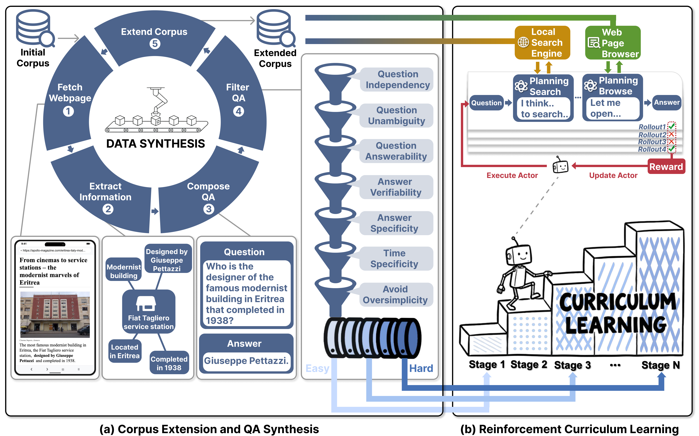

<div align="center">


### A Scalable Agentic RL Training Framework for Deep Research Agent

[Paper](#) · [Project Page](https://simplex-ai-inc.github.io/LiteResearcher/) · [Model](https://huggingface.co/simplex-ai-inc/LiteResearcher-4B)

</div>

**LiteResearcher** is a training framework that makes Agentic RL scalable for deep research agents. By constructing a lite virtual world that mirrors real-world search dynamics, we enable a continuously improving training recipe that empowers a tiny 4B search agent to outperform large-scale open-source and commercial models.

**LiteResearcher-4B** achieves **71.3%** on GAIA and **78.0%** on Xbench-DeepSearch, surpassing models up to 8× larger (Tongyi DeepSearch 30B, WebSailor 30B) and matching commercial systems (Claude-4.5-Sonnet, GPT-5).

## Results

| Model | GAIA-Text | BrowseComp | Browse.(ZH) | HLE | Frames | WebWalker | Seal-0 | Xbench-DS |
|-------|-----------|-----------|-------------|-----|--------|-----------|--------|-----------|
| | ***Commercial Models*** | | | | | | | |
| Claude-4-Sonnet | 68.3% | 12.2% | 29.1% | 20.3% | 80.7% | 61.7% | — | 64.6% |
| Claude-4.5-Sonnet | 71.2% | 19.6% | 40.8% | 24.5% | 85.0% | — | 53.4% | 66.0% |
| DeepSeek-V3.2 | 63.5% | 67.6% | 65.0% | 40.8% | 80.2% | — | 38.5% | 71.0% |
| DeepSeek-V3.1 | 63.1% | 30.0% | 49.2% | 29.8% | 83.7% | 61.2% | — | 71.0% |
| Minimax-M2 | 75.7% | 44.0% | 48.5% | 31.8% | — | — | — | 72.0% |
| OpenAI-GPT-5-high | 76.4% | 54.9% | 65.0% | 35.2% | — | — | 51.4% | 77.8% |
| GLM-4.6 | 71.9% | 45.1% | 49.5% | 30.4% | — | — | — | 70.0% |
| Kimi-Researcher | — | — | — | 26.9% | 78.8% | — | 36.0% | 69.0% |
| Kimi-K2-0905 | 60.2% | 7.4% | 22.2% | 21.7% | 58.1% | — | 25.2% | 61.0% |
| | ***Open-Source Models*** | | | | | | | |
| Mirothinker 8B | 66.4% | 31.1% | 40.2% | 21.5% | 80.6% | 60.6% | 40.4% | 60.6% |
| Tongyi Deepsearch 30B | 70.9% | **43.4%** | **46.7%** | **32.9%** | **90.6%** | 72.2% | — | 75.0% |
| ASearcher QWQ v2 32B | 58.7% | — | — | — | 74.5% | — | — | 51.1% |
| WebSailor 30B | 53.2% | — | — | — | — | — | — | 53.3% |
| WebDancer 32B (QwQ) | 51.5% | 3.8% | 18.0% | — | — | 47.9% | — | 38.3% |
| WebExplorer 8B | 50.0% | 15.7% | 32.0% | 17.3% | 75.7% | 62.7% | — | 53.7% |
| DeepMiner 32B | 58.7% | 33.5% | 40.1% | — | — | — | — | 62.0% |
| AFM-RL 32B | 55.3% | 11.1% | — | 18.0% | — | 63.0% | — | — |
| SFR-DeepResearch 20B | 66.0% | — | — | 28.7% | 82.8% | — | — | — |
| AgentCPM-Explore 4B | 63.9% | 24.1% | 29.1% | 19.1% | 82.7% | 68.1% | 40.5% | 70.0% |
| **LiteResearcher-4B** | **71.3%** | 27.5%* | 32.5%* | 22.0% | 83.1% | **72.7%** | **41.8%** | **78.0%** |

Best open-source results in **bold**. Results with * use a 64k context window with a memory mechanism.

## Method Overview

<div align="center">

</div>

Three pillars enable scalable Agentic RL:

1. **Co-construct Training Data & Corpus** — Scale up information sources with a simple-but-effective synthesis pipeline, then co-evolve training QA pairs and the local webpage corpus.
2. **Stable Local Tool Environment** — Build local search engine (Milvus + BGE-M3) and local browse tool (PostgreSQL) from ~32M real webpages, achieving 10–46× speedup at zero marginal cost.
3. **Difficulty-Aware Curriculum RL** — Multi-stage curriculum with on-policy GRPO, filtering tasks by pass@8 difficulty to sustain monotonic improvement.

## Repository Structure

```
├── Inference/              # Inference & evaluation (released)
├── Training/               # RL training (coming soon)
├── DataGen/                # Data synthesis (coming soon)
├── Environment/            # Local search/browse environment (coming soon)
└── docs/                   # Project page
```

## Quick Start — Evaluation

```bash
cd Inference
pip install -r requirements.txt
cp .env.example .env
# Edit .env: set MODEL, SERPER_KEY_ID, SCRAPEDO_API_KEY

# Start model server (SGLang/vLLM)
bash scripts/start_sglang.sh

# Run evaluation
bash scripts/run_all.sh
```

See [`Inference/README.md`](Inference/README.md) for detailed configuration and usage.

## Release Plan

- [x] Evaluation code
- [x] Project page
- [x] Model weights (LiteResearcher-4B)
- [ ] Training code (GRPO + curriculum RL)
- [ ] Data synthesis pipeline
- [ ] Local search/browse environment setup

## Citation

```bibtex
@article{li2026literesearcher,
  title={LiteResearcher: A Scalable Agentic RL Training Framework for Deep Research Agent},
  author={Li, Wanli and Qu, Bince and Pan, Bo and Zhang, Jianyu and Liu, Zheng and Zhang, Pan and Chen, Wei and Zhang, Bo},
  year={2026}
}
```

## License

Apache 2.0
